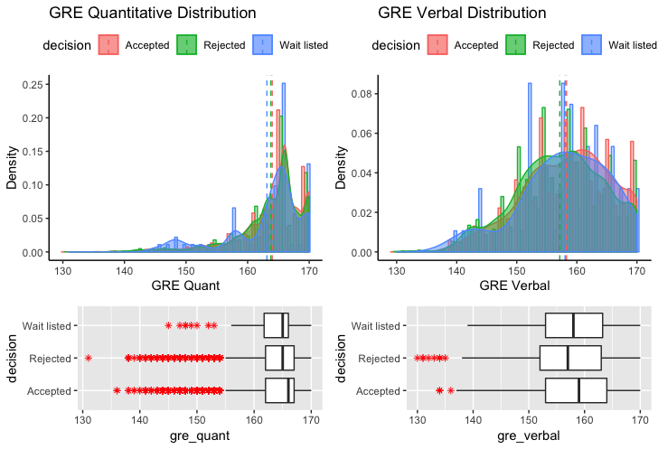

# CS Graduate School Admission: Analysis and Prediction
Analyzing historical CS graduate admission records in the US from 2009 Fall to 2016 Fall and try to make predictions.

## Contributors
[Boxuan (Robert) Li](https://www.li-boxuan.com/), [Wenxu (Mike) Mao](http://mike-mao.com/), and [Jingran (Jerome) Zhou](http://jingran-zhou.com/), all contributed equally.

## Questions to Which We Seek Answers
- What are the factors that are related to admission results?
- Is there a single dominant factor in the context of admission?
- Does GPA or GRE scores matter?
- How can we predict the admission result?
- Are there any interesting phenomena that can be found within admission data?

## Dataset: `TheGradCafe`
The dataset we use is the [TheGradCafe](https://github.com/deedy/gradcafe_data). We utilize the subset of computer science admission data of 27,822 results.

## Interesting Findings
### Skewness of GRE score distributions
The timespan of the 27,822 admission results are 8 years (15 seasons), from 2009 Fall to 2016 Fall. Several key statistics regarding the five *quantitative* variables are shown below. We hypothesize that `gpa`, `gre_verbal`, `gre_quant`, and `gre_subject` all follow a left-skewed distribution, while `gre_writing` has relatively lower skewness.

| Statistics | `gpa` | `gre_verbal` | `gre_quant` | `gre_writing` | `gre_subject` |
| ---------- | ----- | ------------ | ----------- | ------------- | ------------- |
| Min.:      | 1.000 | 130.0        | 131.0       | 2.00          | 200.0         |
| 1st Qu.:   | 3.500 | 153.0        | 162.0       | 3.50          | 750.0         |
| Median:    | 3.700 | 158.0        | 166.0       | 4.00          | 820.0         |
| Mean:      | 3.648 | 157.8        | 163.9       | 3.89          | 799.3         |
| 3rd Qu.:   | 3.870 | 163.0        | 167.0       | 4.50          | 857.5         |
| Max.:      | 4.000 | 170.0        | 170.0       | 6.00          | 990.0         |

As can be seen from the figure below, **GRE verbal**, **GRE quantatitive**, and **GRE writing** all follow a left-skewed distribution. `gre_quant` is probably the most skewed, while `gre_writing` has the least skewness among the three.

For GRE quantitive scores, although the 1st and 3rd quartiles are similar, accepted applicants have a higher median value than the other two types. The same argument applies to GRE verbal scores. Comparing the quantitative and verbal score distributions, we observe that the distribution of GRE quantitative scores is more left-skewed and has a higher median than its verbal distribution, in line with the empirical evidence that most students have a high quantitative GRE score.

In contrast, the GRE writing distribution is obviously more balanced. An interesting discovery is that accepted and rejected applicants share a similar distribution. Both have almost identical minimum, maximum, lower and upper quartiles, with a common median at 4. Additionally, we find that the subset of waitlisted candidates is much smaller than its accepted and rejected counterpart. The summary below confirms our observation - "waitlisted" results constitute around merely 1.48% of the whole dataset. Furthermore, empirical evidence suggests that the majority of waitlisted candidates will be rejected in the end. Considering the above factors, we will treat waitlisted applicants as if they were rejected.

| Category     | `decision` |
| ------------ | ---------- |
| NA:          | 804        |
| Accepted:    | 9971       |
| Rejected:    | 10912      |
| Wait listed: | 326        |

### Correlation matrix

The figure below shows a correlation matrix containing certain variables of interest. Since our data do not necessarily come from a bivariate normal distribution, we decide to choose Kendall's tau statistic to estimate a rank-based measure of association for its higher robustness.

Certain entries correspond with empirical evidence. For instance, GRE writing and verbal scores have a strong correlation of 0.33 because both likely are associated with a candidate's communication and understanding abilities.

{#fig:corr_w_rank width=50%}

Moreover, our goal, `decision`, seems to have limited correlation with any of the variables. Therefore, arguably there might not be a single dominant factor influencing admission decisions. However, a salient point is that the ranking of graduate schools is negatively correlated with admission decisions, with a relatively large coefficient of -0.2.

### Trends of Admission over the Years

In addition, we have also explored the change of admission rate over the years, shown in figure below.

{#fig:ad width=40%}

For spring admission, there is a large number of variations, which might due to the fact that the sample size is relatively small, especially compared with the fall season data. Surprisingly, as opposed to the common sense that graduate school admission is progressively competitive, the admission rate, as shown in the dataset, is in reality increasing.

### Relationship Between Applicant GPA and School Ranking

Lastly, Figure @fig:rank_v_gpa explores the relationship (if any) between two significant factors, namely the graduate school’s ranking and a candidate's GPA. First, note that the distribution of applicants’ GPA again follows as **left-skewed** distribution, which shows that most students who apply to graduate schools have a relatively high GPA, regardless of whether they are accepted or not in the end.

{#fig:rank_v_gpa width=50%}

Furthermore, we observe that by and large, the candidates with a higher GPA usually apply to schools of higher ranking. But the intercept of the accepted and rejected candidates are different - rejected candidates have an intercept that corresponds to a higher university ranking than their accepted counterparts. Therefore, we would suggest applicants to graduate schools make cautious and informed decisions regarding their target universities.

## Preprocessing

### Effect of University Ranking

There is not any quantitative information about universities in the *original* dataset - we only have university names.
If we simply omit that field, we lose all information about universities. In that case, our prediction would
purely rely on student's information, i.e. gre, gpa, etc, which means very likely the best prediction would
be a guess that better students have higher chances to get accepted.

It is necessary to incorporate other datasets. We choose [QS World University Ranking](https://www.kaggle.com/mylesoneill/world-university-rankings.), write a script to match university
names of gradcafe dataset and world ranking of @qsgithub. Then we generate a new dataset, which has the ranking
of each university that the student is applying to. We use Logistic Regression and SVM to evaluate it. The cross-validated
results are summarized in the table below.

|                     | LR w/o U.R. | LR w/ U.R. | SVM w/o U.R. | SVM w/ U.R. |
|---------------------|:---------------------------------------:|:------------------------------------:|:-----------------------:|:--------------------:|
| Trn Acc   |                  56.61%                 |                63.87%                |          59.48%         |        67.84%        |
| Vld Acc |                  56.39%                 |                63.25%                |          56.41%         |        64.17%        |

:Effect of University ranking

### Incorporating Categorical University Name Information

Incorporating ranking information was extremely helpful in predicting the outcome of the application, however, that was not good enough. The university ranking only provides an ordinal perspective, but in reality, a higher university ranking doesn't necessarily indicate that the admission rate is lower. On the other hand, a horizontal comparison of students applying to the same university may be of a better reference. Therefore, we would need a way to utilize this nominal / categorical information.

Our solution is to encode the university name with *one-hot encoding*. The first step is to encode the universities names into a numerical label. We implemented this with the `LabelEncoder` provided by `scikit-learn`. This process is illustrated below:

$$
\begin{bmatrix}
    \text{Arizona State University (ASU)}\\
    \text{Auburn University}\\
    \text{Boston University (BU)}\\
    \vdots\\
    \text{Yale University}
\end{bmatrix} \rightarrow \begin{bmatrix}
    0\\
    1\\
    2\\
    \vdots\\
    118
\end{bmatrix}
$$

Then we would just need to encode these integers into multiple boolean variables. We implemented this with the `OneHotEncoding` interface provided by `scikit-learn`, see the illustration below.

$$
\begin{bmatrix}
    0\\
    1\\
    2\\
    \vdots\\
    118
\end{bmatrix} \rightarrow \begin{bmatrix}
    1 & 0 & 0 & \dots & 0\\
    0 & 1 & 0 & \dots & 0\\
    0 & 0 & 1 & \dots & 0\\
    \vdots & \vdots & \vdots & \ddots & \vdots\\
    0 & 0 & 0 & \dots & 1\\
\end{bmatrix}
$$

Then we applied these two transformations in succession on the "University Names" column of the input data and concatenated the generated matrix to the input data, and it boosted the performance of both logistic regression and support vector machine. The cross-validated results are summarized in the tables below.

|                    | Logistic Regression without One Hot | Logistic Regression with One Hot | SVM without One Hot | SVM with One Hot |
|--------------------|:-----------------------------------:|:--------------------------------:|:-------------------:|:----------------:|
|  Training Accuracy |                63.87%               |              67.53%              |        67.84%       |      70.82%      |
|  Testing Accuracy  |                63.25%               |              65.67%              |        64.17%       |      66.74%      |

:Effect of One-Hot Encoded University Name on Logistic Regression and SVM

However, simply feeding the updated dataset to Random Forest yields very bad performance, this is mainly due to two reasons. The first reason is that the number of original features are drowned by the new binary features, and the old parameters (especially `mtry` / `max_features`) are not suitable for the new dataset. The second reason is that the newly introduced parameters are all discrete, which random forest has not been utilizing very well (TODO is this true?).

# Models

## Logistic Regression

We started off with logistic regression. Using the functions provided by the Python package `scikit-learn`, we defined a logistic regression model with default parameters which gave a training accuracy of 63.49% and a validation accuracy of 63.05%.

### Normalization

Then we tried to improve the performance by applying *normalization*. We implemented this with the `StandardScaler` API provided by scikit-learn model selection package. The results are summarized in the table below.

|                      | Without Normalization | With Normalization |
|----------------------|:---------------------:|:------------------:|
|  Training Accuracy   |         67.37%        |       68.12%       |
|  Validation Accuracy |         65.95%        |       66.03%       |

: Cross-Validated Effect of Normalization

We are able to see some tiny improvements but the accuracy gain is quite insignificant. This is likely due to logistic regression's built-in strategy of handling large input ranges (by assigning the value a small weight).

## Support Vector Machine

Support vector machine is widely used for classification problems.
We use `svm` API provided by scikit-learn python package. We use cross-validation to try out different kernels.

|                     | `linear` | `poly`   | `rbf` (Default) | `sigmoid` |
|---------------------|--------|--------|---------------|---------|
| Training Accuracy   | 68.01% | 66.32% | 70.82%        | 66.19%  |
| Validation Accuracy | 66.13% | 62.28% | 66.74%        | 64.91%  |

: Cross-Validated Effect of Kernels on SVM

From the table we can see the default kernel, i.e. rbf kernel performs best.
The radial basis function kernel, or rbf kernel, is a popular kernel function used in support vector machine classification.

## Generalized Additive Model

For binary classification problems, we can use a logistic GAM which models:

$$log\left(\frac{P(y=1|X)}{P(y=0|X)}\right)=\beta_0+f_1(X_1)+f_2(X_2, X3)+\dots+f_M(X_N)$$

GAM gives training accuracy of 67.45% and validation accuracy of 66.15%

## K-Nearest Neighbors

k-nearest neighbors is widely used in classification problems. Using the functions provided by the Python package `scikit-learn`,
we defined a k-nearest neighbors model which gave a training accuracy of 69.36% and a validation accuracy of 63.19%
(under N=14).

### Normalization

Then we tried to improve the performance by applying *normalization*. Again, we implemented this with the `StandardScaler` API provided by scikit-learn model selection package. The results are summarized in the table below.

|                     | Without Normalization (N=14) | With Normalization (N=26) |
|---------------------|:----------------------------:|:-------------------------:|
| Training Accuracy   |            69.36%            |           67.70%          |
| Validation Accuracy |            63.19%            |           64.50%          |

:Cross-Validated Effect of Normalization on kNN

{#fig:knn width=40%}

As shown in the Figure, we use cross-validation to try different hyperparameters, i.e. number of nearest neighbors.
N = 14 performs best when normalization is not used, while N = 26 performs best when normalization is used. From the comparison, we can see that normalization improves the model.

### Random Forest

Vanilla random forest (implemented in python sklearn library) with default parameters achieved a training accuracy of 66.00% and a testing accuracy of 98.16%, an acceptable result but with significant overfitting.

|                | default | `min_sample_leaf=5` |
|----------------|---------|-----------------|
| Train Accuracy | 98.16%  | 85.48%          |
| Test Accuracy  | 66.00   | 67.01%          |

:vanila random forest

The default model has clear overfitting. By restricting the minimum leaf to have size 5, the model's performance increased by 1 percent.

#### PCA
We know that different universities could have vastly different admission rate which is beyond what the ranking could tell. In order to have that information to the model, we use one hot encoding to encode the university name. However, one hot encoding creates additional 100 predictors which makes it hard for the random forest to use. The model's prediction accuracy actually drops to 66.25% right after this change. At this point, Principal Component Analysis come to save the world. By compressing the above 100+ predictors to 20, the model's performance restores to 67% but no real improvement can be observed. The interpretation here is that there is no significant difference in admission rate across years.

### Neural Network
After data engineering, the dataset contains less than 5000 examples, which is a very small number to train a neural network. Nevertheless, we try to train a small neural network with predictors as input, two fully connected layers and output one hot encoded prediction. The network trained has test accuracy 66.5% which is not as good as random forest or support vector machine. We reason that this result is partially due to the small size of the dataset or the impurity of the data.

{#fig:neural width=70%}

# Result
The best cross-validation accuracy we can obtain is ~67% with random forest so we further fine tune the random forest model and use it for testing. The final train accuracy is 90.65% and test accuracy is 70.14%.

We can examine the importance scores of the variables to interpret the model.

| relative importance | parameter name                           |
|---------------------|------------------------------------------|
| 0.198700            | university_ranking                       |
| 0.181300            | gpa                                      |
| 0.151300            | gre_verbal                               |
| 0.118900            | gre_quant                                |
| 0.075700            | year                                     |
| 0.066300            | university_publication                   |
| 0.065900            | university_faculty                       |
| 0.061000            | gre_writing                              |
| 0.022400            | is_phd                                   |
| 0.020300            | is_american                              |
| 0.017300            | is_ms                                    |
| 0.016000            | is_international_without_american_degree |
| 0.004300            | is_international_with_american_degree    |
| 0.000300            | is_spring                                |
| 0.000300            | is_fall                                  |

:Importance scores of variables in building random forest

The most import predictor here is university_ranking which means that in general, the better the university is, the harder it is for the applicants to get admitted. GPA is almost as important as university_ranking which can means that students' individual effort really matter as well. Surprisingly, GRE_verbal is more important than GRE_quant. One possible explanation here is that most CS applicants have good quantitative skills so GRE_Verbal actually better differentiate the applicants. Year is the next important feature which speaks that the course of history shall not be ignored.

# Conclusion

## Findings

Our research finds that there is no single dominant factor in graduate school admission. GRE and GPA do matter, but they
are not as important as people usually imagine. We also find that universities with lower rankings have relatively
higher acceptance rate. Tree methods provide insights on importance of factors and random forest
is the best one among all models we tried, with training accuracy of 90.65% and test accuracy of 70.14%. The precision
rate is 67.89%, the recall rate is 64.98% and the F1 score is 0.664.

## Future Directions

One major limitation of our research is that predictive capabilities are restricted by the very limited data. One future
step is to extract linguistical features from comments. Moreover, we only focus on computer science major, but our
methodology could be easily applied to other majors. Future improvement might also include data collection from undergraduate
school information, so that we have more data of applicants.
